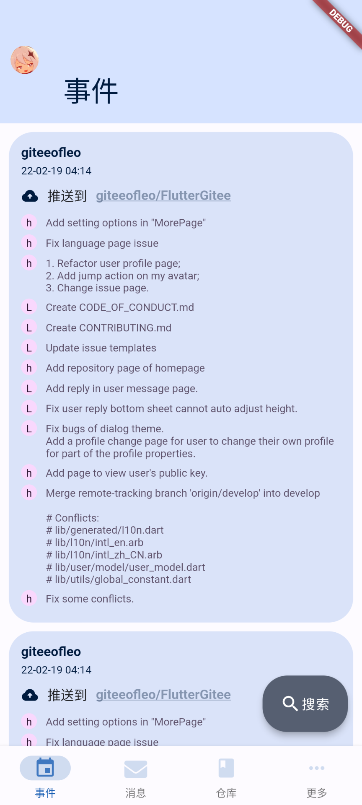
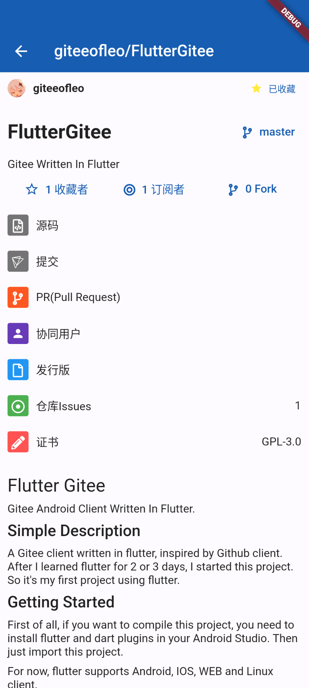
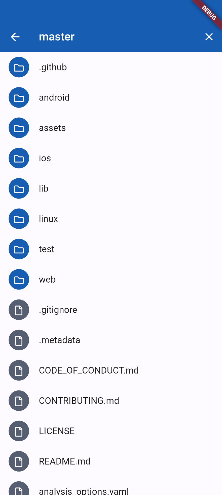
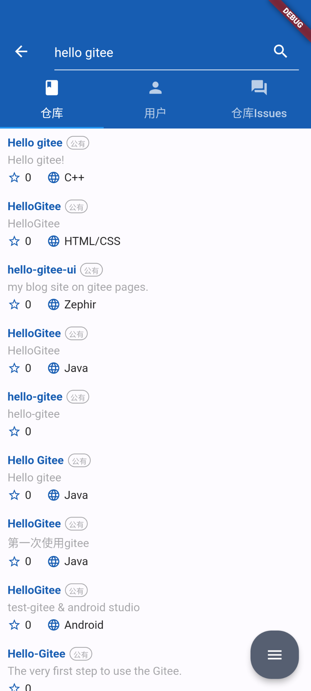

# Flutter Gitee

Gitee Android Client Written In Flutter.

## Simple Description

A Gitee client written in flutter, inspired by Github client. After I learned flutter for 2 or 3 days, I started this project. So it's my first project using flutter.

## Getting Started

First of all, if you want to compile this project, you need to install flutter and dart plugins in your Android Studio. Then just import this project. 

For now, flutter supports Android, IOS, WEB and Linux client.

### Plugin Recommendation

+ [Flutter](https://plugins.jetbrains.com/plugin/9212-flutter). Necessary plugin for developing flutter applications.
+ [Dart](https://plugins.jetbrains.com/plugin/6351-dart). Necessary plugin for dart langauge.
+ [FlutterJsonBeanFactory(Only Null Safety)](https://plugins.jetbrains.com/plugin/11415-flutterjsonbeanfactory-only-null-safety-). Generate bean class conveniently.
+ [Flutter Enhancement Suite](https://plugins.jetbrains.com/plugin/12693-flutter-enhancement-suite). Create flutter widget conveniently.

## Contribution

Before making contribution, make sure you have obtained client ID and client secret in Gitee. You should follow [this instruction](https://gitee.com/api/v5/oauth_doc#/list-item-3) to create your personal third-party application.

> Notice: Don't push your codes with your personal id and secret, they belong to you only!

Fork this project to your own repositories, and most importantly, don't forget to replace two constants: `clientID` and `clientSecret` defined in `flutter_gitee/lib/utils/app_secret.dart` with your client ID and client secret.  

## Goal

My goal is to implement most of the Gitee APIs. You can find the documentation [here](https://gitee.com/api/v5/swagger).

## Current progress

### Basic Features

- [x] Login/Logout
- [x] View user events/activities
- [x] View user repositories
- [x] View user starred repositories
- [x] View user watched repositories
- [x] View user issues
- [x] View user's subscribers and followings
- [x] View user profile
- [x] Change global theme
- [x] Search for users
- [ ] Auto login(Currently not supported due to lacking of api documentation)
- [x] View messages from server and users
- [x] Send messages to another user
- [ ] More user-related processes

### Repository Features

- [x] View details of repositories, including stargazers/watchers/forks
- [x] View files and codes of repositories
- [x] View commits and their details
- [x] View pull requests
- [x] View collaborators of repositories
- [x] View releases of repositories, and provide download url
- [x] Star a repository
- [x] Search for repositories
- [x] Search for issues
- [x] View issue details ,including comments
- [x] Available commenting an issue
- [ ] View opensource license
- [ ] More repository-related processes

### Samples

|  |  |  |  |
| -- | -- | -- | -- |
