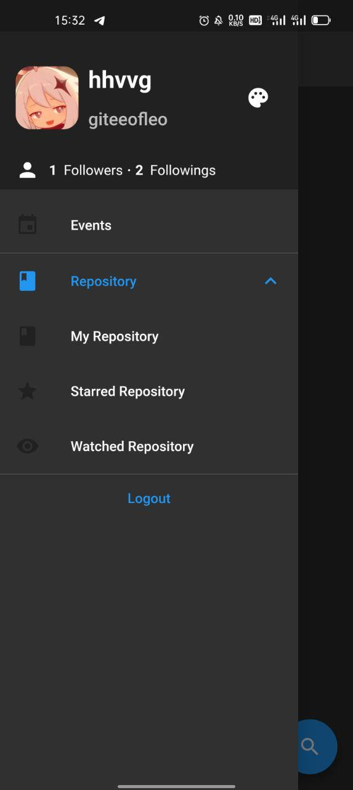
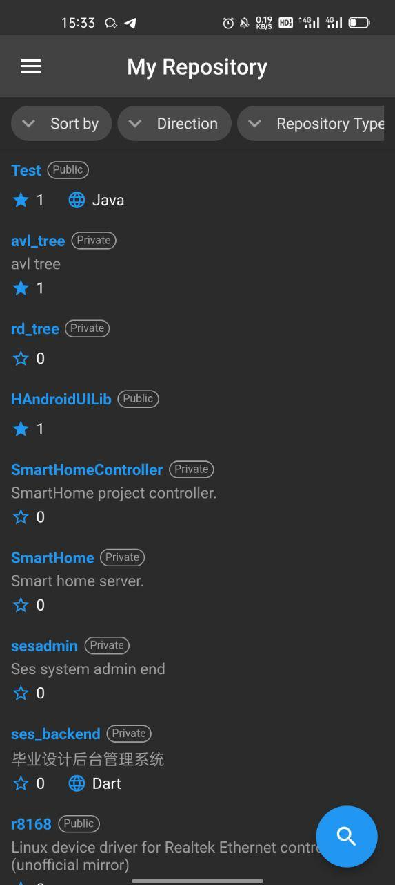
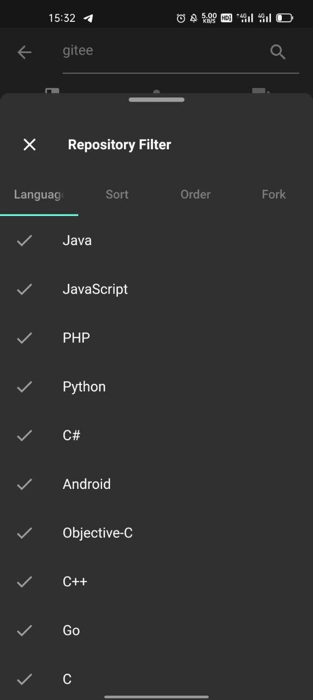

# Flutter Gitee

Gitee Android Client Written In Flutter.

## Simple Description

A Gitee client written in flutter, inspired by Github client. After I learned flutter for 2 or 3 days, I started this project. So it's my first project using flutter.

## Getting Started

First of all, if you want to compile this project, you need to install flutter and dart plugins in your Android Studio. Then just import this project. 

For now, flutter supports Android, IOS, WEB and Linux client.

## Contribution

Before making contribution, make sure you have obtained client ID and client secret in Gitee. You should follow [this instruction](https://gitee.com/api/v5/oauth_doc#/list-item-3) to create your personal third-party application.

> Notice: Don't push your codes with your personal id and secret, they belong to you only!

Fork this project to your own repositories, and most importantly, don't forget to replace two constants: `clientID` and `clientSecret` defined in `flutter_gitee/lib/utils/app_secret.dart` with your client ID and client secret.  

## Goal

My goal is to implement most of the Gitee APIs. You can find the documentation [here](https://gitee.com/api/v5/swagger).

## Current progress

